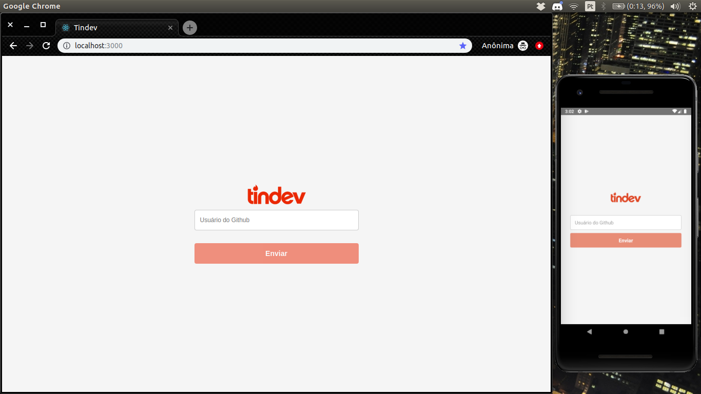

<h1 align="center">
  
</h1>

<h3 align="center">
  Tindev, Frontend, Mobile e Backend
</h3>

<blockquote align="center">“Nunca devemos mudar de cavalo no meio do rio.”!</blockquote>

<p align="center">
  <a href="#-tecnologias">Tecnologias</a>&nbsp;&nbsp;&nbsp;|&nbsp;&nbsp;&nbsp;
  <a href="#-projeto">Projeto</a>&nbsp;&nbsp;&nbsp;|&nbsp;&nbsp;&nbsp;
  <a href="#-instalação-e-execução">Instalação e execução</a>&nbsp;&nbsp;&nbsp;|&nbsp;&nbsp;&nbsp;
  <a href="#-licença">Licença</a>
</p>

<br>

<p align="center">
  
</p>

## 🚀 Tecnologias

Esse projeto foi desenvolvido com as seguintes tecnologias:

- [Node.js](https://nodejs.org/en/)
- [React](https://reactjs.org)
- [React Native](https://facebook.github.io/react-native/)

## 💻 Projeto

Tindev é uma aplicação desenvolvido durante a semana omnistack 08 e a ideia por trás desse projeto é criar um "tinder" para devs.

A aplicação possui um versão Web(react) e Mobile(React Native) que consomem a api do back end(node).

Para poder acessar a aplicação o usuário deve inserir seu login do github. Após logado o usuário pode listar outros devs no sistema, dar like ou dislike no dev, e em caso de match ambos os devs recebem uma notificação.

<b>IMPORTANTE:</b> Para realizar a notificação em tempo real foi utilizando socket.io nesse projeto.

## 📥 Instalação e execução

Faça um clone desse repositório

  ### Backend
  1. A partir da raiz do projeto, entre na pasta rodando `cd backend`;
  2. Inicie os bancos de dados mongodb utilizando docker:
  ```bash
    $ docker run --name mongo -p 27017:27017 -d -t mongo
  ```
  3. Crie um arquivo `.env` a partir do arquivo `.env.example` preenchendo todas as variáveis pedidas;
  4. Rode `npm install` para instalar todas as dependências;
  5. Rode `npm run build && npm run start` em um novo terminal para compilar e iniciar o servidor node;

  ### Frontend
  1. A partir da raiz do projeto, entre na pasta rodando `cd frontend`;
  2. Rode `npm install` para instalar as dependências;
  3. Rode `npm run start` para iniciar o servidor de desenvolvimento;
  4. Abra `http://localhost:3000` para ver o projeto no navegador.

  ### Mobile
  1. A partir da raiz do projeto, entre na pasta rodando `cd mobile`;
  2. Rode `npm install` para instalar as dependências;
  3. Rode `npm run start` para iniciar o servidor de desenvolvimento;
  4. Cheque o ip do servidor e substitua `localhost` do atributo `baseURL` no arquivo `src > services > api.js`;
  5. Rode `npm run android` para iniciar a instalação no smartphone;
  
  <i>Obs.:</i> Projeto mobile desenvolvido apenas para a plataforma <strong>android</strong>.

## 📝 Licença

Esse projeto está sob a licença MIT. Veja o arquivo [LICENSE](LICENSE.md) para mais detalhes.